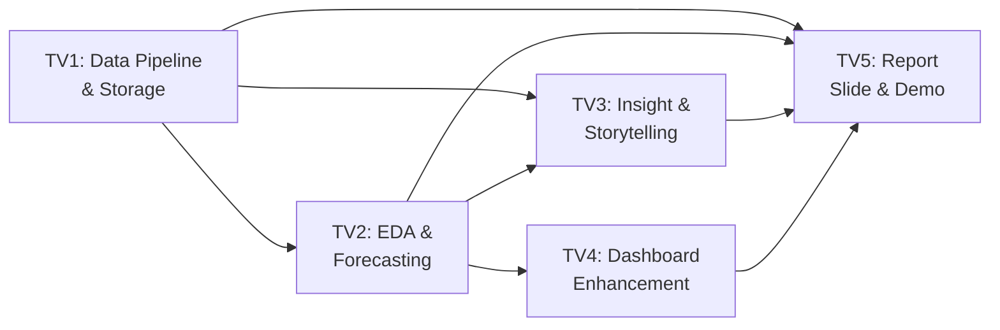

# 📊 PHÂN TÍCH TIẾN ĐỘ ĐỒ ÁN: WORLD MONITOR

> **Dự án:** Data Monitoring & Analytics Application — Giám sát thị trường tài chính (Crypto, Stocks, Gold/Silver, Forex)
>
> **Ngày đánh giá:** 2026-05-08

---

## 1. TỔNG QUAN NHỮNG GÌ ĐÃ LÀM ĐƯỢC

### ✅ (1) Data Collection — Thu thập dữ liệu (HOÀN THÀNH ~90%)

| Nguồn dữ liệu | Công nghệ | Trạng thái |
|---|---|---|
| Crypto (BTC, ETH, SOL, BNB, XRP, ADA, DOGE, AVAX, LINK, MATIC...) | ccxt (Binance) + CoinGecko API | ✅ Hoàn thành |
| Stocks (AAPL, MSFT, NVDA, TSLA, GOOGL, AMZN, META) | yfinance + Yahoo Chart API fallback | ✅ Hoàn thành |
| Indices (S&P500, NASDAQ, DJI) | yfinance + Yahoo Chart API | ✅ Hoàn thành |
| Gold & Silver (GC=F, SI=F, XAUUSD, XAGUSD) | yfinance + Yahoo Chart API | ✅ Hoàn thành |
| Forex (EUR/USD, GBP/USD, USD/JPY, USD/CHF, AUD/USD, USD/CAD) | yfinance + Yahoo Chart API | ✅ Hoàn thành |
| News & Macro Events | RSS feeds (CoinDesk, CoinTelegraph, Investing.com, Reuters, Yahoo) | ✅ Hoàn thành |

**Cập nhật dữ liệu:**
- Realtime polling: giá cập nhật mỗi 5 giây, OHLCV mỗi 15 giây
- News: cập nhật mỗi 5 phút
- Insight report: rebuild mỗi 10 phút

### ✅ (2) Data Processing & Storage (HOÀN THÀNH ~70%)

| Tính năng | Trạng thái | Ghi chú |
|---|---|---|
| Chuẩn hóa dữ liệu (Pydantic schemas) | ✅ | PriceTick, Candle, OHLCV, Alert... |
| Caching (in-memory TTL cache) | ✅ | cachetools cho prices, ohlcv, alerts |
| WebSocket broadcasting | ✅ | Real-time market data + alerts |
| SSE (Server-Sent Events) | ✅ | Alert stream |
| OHLCV DataFrame conversion | ✅ | pandas DataFrame pipeline |
| **Lưu trữ vào Database / CSV** | ❌ | **Chỉ cache in-memory, không persist** |
| **Làm sạch dữ liệu (handling missing/noise/duplicates)** | ⚠️ | Cơ bản có nhưng chưa documented |

### ✅ (3) Data Analysis / EDA (HOÀN THÀNH ~60%)

| Phân tích | Trạng thái | Chi tiết |
|---|---|---|
| Xu hướng thời gian (trend) | ✅ | SMA20/50 cross, bullish/bearish/sideway detection |
| Phân bố dữ liệu (distribution) | ✅ | Returns Distribution histogram trên dashboard |
| Phát hiện bất thường (anomaly) | ✅ | Volume spike detection, IsolationForest, FOMO warning |
| So sánh đa yếu tố | ✅ | Correlation matrix (Pearson), Normalized Performance chart |
| Pattern detection | ✅ | FOMO, Divergence (bearish/bullish RSI), Whale activity, Price spike |
| Timezone analysis | ✅ | Asia/Europe/US session volume & volatility |
| Capital rotation analysis | ✅ | BTC vs Gold rotation, S&P vs EUR/USD |
| **EDA Notebook (Jupyter)** | ❌ | **Chưa có notebook EDA riêng** |
| **Phân tích có chiều sâu + giải thích** | ⚠️ | Có insights tự động nhưng chưa có narrative/storytelling |

### ✅ (4) Visualization Dashboard (HOÀN THÀNH ~85%)

| Component | Trạng thái | Mô tả |
|---|---|---|
| **Dashboard chính (/)** | ✅ | Market Overview KPIs, Multi-asset sparklines |
| Fear & Greed Gauge | ✅ | Plotly gauge chart |
| Market Dominance Donut | ✅ | BTC/ETH/Others pie chart |
| 24h Volume by Asset Class | ✅ | Bar chart (log scale) |
| 24h Returns Distribution | ✅ | Histogram with color mapping |
| Candlestick Chart | ✅ | TradingView Lightweight Charts |
| Top Gainers / Losers | ✅ | Ranked list |
| Performance Comparison | ✅ | Normalized line chart (base=100) |
| Volatility Radar | ✅ | Scatterpolar chart |
| Top 10 Market Cap | ✅ | Horizontal bar chart |
| BTC Hourly Activity Heatmap | ✅ | Day-of-week × Hour heatmap |
| Sector Heatmap/Treemap | ✅ | Crypto sectors + Stock sectors |
| Portfolio Tracker | ✅ | P&L calculation |
| **Analytics Page (/analytics)** | ✅ | Technical indicators (SMA, EMA, BB, RSI, MACD, ATR, Volatility) |
| Correlation Matrix | ✅ | Cross-asset Pearson correlation heatmap |
| Intraday Timeline | ✅ | Pump/Dump detection chart |
| **Insights Page (/insights)** | ✅ | Daily report, anomalies, timezone analysis, data-driven insights |
| Live Ticker | ✅ | Scrolling price ticker |
| Alert Feed | ✅ | Real-time alerts sidebar (WS + SSE) |
| Sidebar Navigation | ✅ | Dashboard, Analytics, Insights, Portfolio |
| **Filter theo thời gian / điều kiện** | ⚠️ | Có cho timeframe nhưng chưa có date range picker |
| **Responsive / Mobile** | ⚠️ | Grid responsive nhưng chưa optimize mobile |

### ⚠️ (5) Insight & Interpretation ⭐ — QUAN TRỌNG NHẤT (HOÀN THÀNH ~40%)

| Yêu cầu | Trạng thái | Ghi chú |
|---|---|---|
| Xu hướng chính của dữ liệu | ⚠️ | Auto detect bullish/bearish/sideway nhưng **chưa có giải thích sâu** |
| Pattern đáng chú ý | ✅ | FOMO, Divergence, Whale, Spike detection |
| Dự đoán / Giải thích | ❌ | **Chưa có forecasting model (ARIMA, Prophet, LSTM...)** |
| Insight có giá trị thực tế | ⚠️ | Insights tự động (capital rotation, session analysis) nhưng **quá surface-level** |
| **Data storytelling** | ❌ | **Chưa có narrative text giải thích ý nghĩa** |
| **Kết luận tổng quan** | ❌ | **Chưa có conclusion section** |

---

## 2. NHỮNG GÌ CHƯA LÀM ĐƯỢC (CẦN BỔ SUNG)

### 🔴 Thiếu nghiêm trọng (Ảnh hưởng lớn đến điểm)

| # | Hạng mục | Mô tả | Trọng số ảnh hưởng |
|---|---|---|---|
| 1 | **Dự đoán (Forecast)** | Chưa có model dự đoán giá (ARIMA, Prophet, LSTM...) | Insight 30% |
| 2 | **Data Storytelling** | Chưa có narrative giải thích insight, chỉ có bullet points tự động | Insight 30% |
| 3 | **EDA Notebook** | Chưa có Jupyter notebook phân tích EDA chi tiết | EDA 20% |
| 4 | **Persistent Storage** | Không lưu dữ liệu xuống DB/CSV, chỉ cache in-memory | Pipeline 20% |
| 5 | **Report (PDF)** | Chưa có báo cáo | Presentation 10% |
| 6 | **Slide Presentation** | Chưa có slide | Presentation 10% |
| 7 | **Demo Video** | Chưa có video demo | Presentation 10% |

### 🟡 Cần cải thiện

| # | Hạng mục | Mô tả |
|---|---|---|
| 8 | **Date Range Filter** | Chỉ có timeframe filter, chưa có date picker để chọn khoảng thời gian cụ thể |
| 9 | **Data Export** | Không thể export dữ liệu ra CSV/Excel |
| 10 | **So sánh đa nguồn** | Có correlation nhưng chưa có phân tích so sánh sâu giữa các loại tài sản |
| 11 | **Mobile Responsive** | Dashboard chưa tối ưu cho mobile |
| 12 | **Error Handling UI** | Khi API fail, UI chỉ hiện "Loading..." mãi |
| 13 | **Unit Tests** | Không có test nào |

---

## 3. KIẾN TRÚC HỆ THỐNG HIỆN TẠI

```
┌──────────────────────────────────────────────────────────────┐
│                     FRONTEND (Next.js 14)                    │
│  ┌──────────┐ ┌──────────┐ ┌──────────┐ ┌──────────┐       │
│  │Dashboard │ │Analytics │ │ Insights │ │Portfolio │       │
│  │ (12 widgets)│ (Indicators│ (Daily    │ (P&L     │       │
│  │          │ │Correlation│ │ Report)  │ │Tracker)  │       │
│  └──────────┘ └──────────┘ └──────────┘ └──────────┘       │
│  Plotly.js · TradingView Charts · Recharts · Tailwind CSS   │
└───────────────────────┬──────────────────────────────────────┘
                        │ REST / WebSocket / SSE
┌───────────────────────┴──────────────────────────────────────┐
│                     BACKEND (FastAPI)                         │
│  ┌─────────────┐  ┌─────────────┐  ┌─────────────┐          │
│  │ Market API  │  │Analytics API│  │ Insights API│          │
│  │ /prices     │  │ /indicators │  │ /daily      │          │
│  │ /ohlcv      │  │ /correlation│  │ /rebuild    │          │
│  │ /heatmap    │  │ /intraday   │  │             │          │
│  │ /gainers    │  │             │  │             │          │
│  └──────┬──────┘  └──────┬──────┘  └──────┬──────┘          │
│         │                │                │                  │
│  ┌──────┴────────────────┴────────────────┴──────┐          │
│  │              SERVICES LAYER                    │          │
│  │ CryptoService · YFinanceService · StooqService │          │
│  │ MarketService · AlertService · InsightService  │          │
│  │ AnalyticsService · NewsService · PortfolioSvc  │          │
│  └──────────────────┬────────────────────────────┘          │
│                     │                                        │
│  ┌──────────────────┴────────────────────────────┐          │
│  │              ML / ANALYTICS                    │          │
│  │ indicators.py (SMA, EMA, RSI, BB, MACD, ATR)  │          │
│  │ anomaly.py (FOMO, Divergence, Whale, Spike)    │          │
│  │ pattern_recognition.py (orchestrator)          │          │
│  └────────────────────────────────────────────────┘          │
└──────────────────────────────────────────────────────────────┘
        │                    │                  │
   ┌────┴────┐        ┌─────┴─────┐     ┌──────┴──────┐
   │  ccxt   │        │ yfinance  │     │ feedparser  │
   │(Binance)│        │ (Yahoo)   │     │ (RSS Feeds) │
   └─────────┘        └───────────┘     └─────────────┘
```

---

## 4. BẢNG PHÂN CHIA CÔNG VIỆC CHO 5 THÀNH VIÊN

> **Ước tính thời gian:** 2-3 tuần
> **Nguyên tắc:** Mỗi người phụ trách 1 mảng chính + hỗ trợ mảng khác

---

### 👤 THÀNH VIÊN 1 — Data Pipeline & Persistent Storage

**Vai trò:** Xây dựng data pipeline hoàn chỉnh + lưu trữ dữ liệu

| # | Task | Chi tiết | Ưu tiên | Deadline |
|---|---|---|---|---|
| 1.1 | Thiết kế Database Schema | Tạo SQLite/PostgreSQL schema cho: `prices`, `ohlcv_candles`, `alerts`, `news`, `daily_insights` | 🔴 Cao | Tuần 1 |
| 1.2 | Implement Data Persistence Layer | Viết `database.py` service để lưu dữ liệu từ background loops xuống DB | 🔴 Cao | Tuần 1 |
| 1.3 | Historical Data Backfill | Script crawl dữ liệu lịch sử (3-6 tháng) cho các asset chính | 🔴 Cao | Tuần 1 |
| 1.4 | Data Cleaning Pipeline | Xử lý missing values, duplicates, noise trong dữ liệu lịch sử. Document rõ ràng | 🟡 TB | Tuần 2 |
| 1.5 | Data Export API | Thêm endpoint `/api/export` để download data CSV/Excel | 🟡 TB | Tuần 2 |
| 1.6 | Data Quality Report | Viết script kiểm tra data quality: completeness, consistency, freshness | 🟡 TB | Tuần 2 |
| 1.7 | Viết phần Report: Data Pipeline | Mô tả kiến trúc pipeline, data sources, cleaning process, storage strategy | 🟡 TB | Tuần 3 |

**Files cần tạo/sửa:**
- `backend/app/core/database.py` (NEW)
- `backend/app/services/persistence_service.py` (NEW)
- `backend/app/services/background.py` (MODIFY - thêm lưu DB)
- `backend/scripts/backfill.py` (NEW)
- `backend/scripts/data_quality.py` (NEW)
- `backend/app/api/export.py` (NEW)

---

### 👤 THÀNH VIÊN 2 — EDA & Forecasting Models

**Vai trò:** Phân tích EDA chuyên sâu + xây dựng model dự đoán

| # | Task | Chi tiết | Ưu tiên | Deadline |
|---|---|---|---|---|
| 2.1 | EDA Notebook — Market Overview | Notebook phân tích tổng quan: phân bố giá, volume distribution, correlation analysis | 🔴 Cao | Tuần 1 |
| 2.2 | EDA Notebook — Time Series Analysis | Xu hướng dài hạn, seasonality (theo giờ/ngày/tuần), stationarity tests (ADF test) | 🔴 Cao | Tuần 1 |
| 2.3 | EDA Notebook — Anomaly Deep Dive | Phân tích chi tiết các anomaly events, so sánh trước/sau, impact analysis | 🔴 Cao | Tuần 1 |
| 2.4 | Forecasting: ARIMA/SARIMA | Implement model dự đoán giá BTC, Gold, S&P500 sử dụng ARIMA | 🔴 Cao | Tuần 2 |
| 2.5 | Forecasting: Prophet | Implement Facebook Prophet cho dự đoán multi-asset | 🟡 TB | Tuần 2 |
| 2.6 | Forecast API Integration | Tạo endpoint `/api/analytics/forecast` và tích hợp vào dashboard | 🟡 TB | Tuần 2 |
| 2.7 | Model Evaluation | So sánh RMSE, MAE, MAPE giữa các model. Viết trong notebook | 🟡 TB | Tuần 2 |
| 2.8 | Viết phần Report: EDA & Analysis | Mô tả phương pháp EDA, kết quả phân tích, model evaluation | 🟡 TB | Tuần 3 |

**Files cần tạo:**
- `notebooks/01_eda_overview.ipynb` (NEW)
- `notebooks/02_eda_timeseries.ipynb` (NEW)
- `notebooks/03_eda_anomaly.ipynb` (NEW)
- `notebooks/04_forecasting.ipynb` (NEW)
- `backend/app/ml/forecast.py` (NEW)
- `backend/app/api/forecast.py` (NEW)

---

### 👤 THÀNH VIÊN 3 — Insight & Data Storytelling ⭐

**Vai trò:** Phần quan trọng nhất (30% điểm) — viết insight, giải thích dữ liệu, kết luận

| # | Task | Chi tiết | Ưu tiên | Deadline |
|---|---|---|---|---|
| 3.1 | Insight Framework | Xây dựng framework cho insights: "What happened? → Why? → So what? → What next?" | 🔴 Cao | Tuần 1 |
| 3.2 | Market Trend Narrative | Viết giải thích sâu cho từng trạng thái thị trường (bullish/bearish/sideway) | 🔴 Cao | Tuần 1 |
| 3.3 | Cross-Asset Insights | Phân tích mối quan hệ giữa Crypto-Gold-Stock-Forex. Khi nào capital rotation xảy ra? | 🔴 Cao | Tuần 1 |
| 3.4 | Anomaly Interpretation | Với mỗi anomaly detected, giải thích: nguyên nhân có thể, tác động, hành động gợi ý | 🔴 Cao | Tuần 2 |
| 3.5 | Timezone & Session Insights | Phân tích pattern giao dịch theo timezone: phiên Á vs Âu vs Mỹ ảnh hưởng thế nào | 🟡 TB | Tuần 2 |
| 3.6 | Trang Insights UI Enhancement | Cải thiện `/insights` page: thêm markdown rendering, chart annotations, insight cards | 🟡 TB | Tuần 2 |
| 3.7 | Weekly Summary Generator | Auto-generate weekly market summary với narrative text | 🟡 TB | Tuần 2 |
| 3.8 | Viết phần Report: Insight & Conclusion | Phần quan trọng nhất của report. Trả lời 4 câu hỏi lớn của đồ án | 🔴 Cao | Tuần 3 |

**Files cần tạo/sửa:**
- `backend/app/services/insight_service.py` (MODIFY - nâng cấp insights)
- `backend/app/services/storytelling_service.py` (NEW)
- `frontend/app/insights/page.tsx` (MODIFY - UI enhancement)
- `frontend/components/dashboard/InsightCards.tsx` (NEW)
- `docs/insights_analysis.md` (NEW - phân tích chi tiết)

---

### 👤 THÀNH VIÊN 4 — Dashboard Enhancement & Frontend Polish

**Vai trò:** Hoàn thiện dashboard, thêm features UI, tối ưu UX

| # | Task | Chi tiết | Ưu tiên | Deadline |
|---|---|---|---|---|
| 4.1 | Date Range Picker | Thêm filter chọn khoảng thời gian (1D, 1W, 1M, 3M, 6M, 1Y, Custom) cho tất cả charts | 🔴 Cao | Tuần 1 |
| 4.2 | Forecast Chart Integration | Hiển thị forecast data trên candlestick chart (confidence interval) | 🔴 Cao | Tuần 1 |
| 4.3 | Comparison Page | Trang so sánh đa nguồn: chọn 2-5 assets để so sánh trực tiếp (overlay chart) | 🟡 TB | Tuần 1 |
| 4.4 | Chart Annotations | Thêm annotations cho events quan trọng (anomaly, pattern, news) trên chart | 🟡 TB | Tuần 2 |
| 4.5 | Mobile Responsive | Tối ưu layout cho mobile/tablet | 🟡 TB | Tuần 2 |
| 4.6 | Error States & Loading | Thêm error boundaries, retry buttons, proper loading skeletons | 🟡 TB | Tuần 2 |
| 4.7 | Dark/Light Mode Toggle | Thêm theme switcher | 🟢 Thấp | Tuần 2 |
| 4.8 | Dashboard Screenshots cho Report | Chụp screenshots đẹp của tất cả charts/pages cho report & slide | 🟡 TB | Tuần 3 |

**Files cần tạo/sửa:**
- `frontend/components/ui/DateRangePicker.tsx` (NEW)
- `frontend/components/charts/ForecastOverlay.tsx` (NEW)
- `frontend/app/comparison/page.tsx` (NEW)
- `frontend/components/ui/ErrorBoundary.tsx` (NEW)
- Sửa tất cả chart components để hỗ trợ date range
- `frontend/app/globals.css` (MODIFY)

---

### 👤 THÀNH VIÊN 5 — Report, Slide & Demo

**Vai trò:** Tổng hợp report, làm slide, quay video demo

| # | Task | Chi tiết | Ưu tiên | Deadline |
|---|---|---|---|---|
| 5.1 | Report Structure | Viết outline report PDF: Problem, Data Pipeline, EDA, Dashboard, Insight, Conclusion | 🔴 Cao | Tuần 1 |
| 5.2 | Report: Problem & Background | Mô tả vấn đề, tại sao cần monitor thị trường tài chính, bối cảnh | 🔴 Cao | Tuần 1 |
| 5.3 | Report: System Architecture | Vẽ sơ đồ kiến trúc, mô tả tech stack, data flow diagram | 🔴 Cao | Tuần 1 |
| 5.4 | Report: Compile All Sections | Tổng hợp phần Data Pipeline (TV1), EDA (TV2), Insight (TV3), Dashboard (TV4) | 🔴 Cao | Tuần 2 |
| 5.5 | Report: Conclusion & Future Work | Viết kết luận, limitations, future improvements | 🟡 TB | Tuần 2 |
| 5.6 | Slide Presentation | Làm slide (15-20 slides): overview, demo screenshots, key findings, Q&A | 🔴 Cao | Tuần 2 |
| 5.7 | Demo Video | Quay video demo 5-10 phút: show dashboard, analytics, insights, forecast | 🔴 Cao | Tuần 3 |
| 5.8 | README & Documentation | Cập nhật README.md với hướng dẫn cài đặt, chạy, cấu trúc project đầy đủ | 🟡 TB | Tuần 3 |

**Files cần tạo:**
- `docs/report.pdf` (NEW)
- `docs/slides.pptx` (NEW)
- `docs/demo_video.mp4` (NEW)
- `README.md` (MODIFY - viết lại chi tiết)

---

## 5. TIMELINE TỔNG QUAN

```
Tuần 1 (Tuần hiện tại)
├── TV1: Database schema + persistence layer + backfill script
├── TV2: 3 EDA notebooks + bắt đầu ARIMA model
├── TV3: Insight framework + Market trend narrative + Cross-asset analysis
├── TV4: Date range picker + Forecast chart component
└── TV5: Report outline + Problem section + Architecture diagram

Tuần 2
├── TV1: Data cleaning docs + Export API + Data quality report
├── TV2: Forecasting models (ARIMA/Prophet) + API integration + Evaluation
├── TV3: Anomaly interpretation + Timezone insights + UI enhancement
├── TV4: Comparison page + Chart annotations + Mobile responsive
└── TV5: Compile report sections + Slide presentation

Tuần 3 (Final)
├── TV1: Report section: Data Pipeline
├── TV2: Report section: EDA & Analysis
├── TV3: Report section: Insight & Conclusion (CRITICAL)
├── TV4: Dashboard screenshots + Final polish
└── TV5: Demo video + Final report compile + README
```

---

## 6. ƯU TIÊN THEO TIÊU CHÍ CHẤM ĐIỂM

| Tiêu chí | Trọng số | Hiện tại | Cần đạt | Người phụ trách |
|---|---|---|---|---|
| **Insight & Interpretation** ⭐ | **30%** | ~40% | 85%+ | **TV3** (chính) + TV2 hỗ trợ |
| Data Pipeline & Quality | 20% | ~70% | 90%+ | **TV1** |
| EDA & Analysis | 20% | ~60% | 90%+ | **TV2** |
| Dashboard & Visualization | 20% | ~85% | 95%+ | **TV4** |
| Presentation & Report | 10% | 0% | 90%+ | **TV5** |

> [!IMPORTANT]
> **INSIGHT (30%)** là phần quan trọng nhất và hiện tại yếu nhất. TV3 cần được ưu tiên cao nhất.
> Không chỉ vẽ chart — phải **giải thích và kết luận**!

---

## 7. CHECKLIST TRƯỚC KHI NỘP

- [ ] Database/CSV lưu trữ dữ liệu hoạt động
- [ ] Có ít nhất 3 EDA notebooks với markdown giải thích
- [ ] Có model forecasting (ARIMA/Prophet) chạy được
- [ ] Dashboard có date range filter
- [ ] Trang Insights có narrative text (không chỉ bullet points)
- [ ] Phân tích cross-asset có chiều sâu
- [ ] Report PDF hoàn chỉnh (Problem → Pipeline → EDA → Insight → Conclusion)
- [ ] Slide presentation 15-20 slides
- [ ] Demo video 5-10 phút
- [ ] README.md cập nhật đầy đủ
- [ ] Code clean, có comments

---

## 8. PHÂN TÍCH PHỤ THUỘC GIỮA CÁC THÀNH VIÊN

### 🔗 Sơ đồ phụ thuộc tổng quan



### 📌 Chi tiết từng mối phụ thuộc

#### TV1 (Data Pipeline) → TV2 (EDA & Forecast)

| Task TV2 | Cần từ TV1 | Mức phụ thuộc | Giải pháp nếu TV1 chưa xong |
|---|---|---|---|
| 2.1 EDA Overview | Dữ liệu lịch sử (1.3 Backfill) | 🔴 **BẮT BUỘC** | TV2 có thể dùng API tự fetch data + lưu CSV tạm để bắt đầu EDA trước |
| 2.2 Time Series Analysis | Dữ liệu lịch sử 3-6 tháng | 🔴 **BẮT BUỘC** | Dùng `yfinance.download()` trực tiếp trong notebook để lấy data lịch sử |
| 2.3 Anomaly Deep Dive | Dữ liệu lịch sử | 🟡 Một phần | Có thể phân tích trên dữ liệu realtime vài ngày |
| 2.4-2.5 Forecasting | DB có data lịch sử sạch | 🔴 **BẮT BUỘC** | Tự fetch trong notebook, không cần đợi DB |

> **⚡ GIẢI PHÁP:** TV2 **KHÔNG CẦN ĐỢI** TV1 nếu tự fetch dữ liệu trong notebook bằng `yfinance.download("BTC-USD", period="6mo")`. TV1 chỉ cần xong trước khi TV2 tích hợp forecast API vào backend (task 2.6).

---

#### TV1 (Data Pipeline) → TV3 (Insight)

| Task TV3 | Cần từ TV1 | Mức phụ thuộc | Giải pháp nếu TV1 chưa xong |
|---|---|---|---|
| 3.1 Insight Framework | Không cần | ✅ Độc lập | — |
| 3.2 Market Trend Narrative | Không cần (dùng insight_service hiện có) | ✅ Độc lập | — |
| 3.3 Cross-Asset Insights | Dữ liệu lịch sử để phân tích correlation dài hạn | 🟡 Một phần | Dùng API hiện tại (90 ngày OHLCV), đủ cho phân tích cơ bản |

> **⚡ GIẢI PHÁP:** TV3 **CÓ THỂ BẮT ĐẦU NGAY** vì phần insight chủ yếu là viết narrative + giải thích, không phụ thuộc DB.

---

#### TV2 (EDA & Forecast) → TV3 (Insight)

| Task TV3 | Cần từ TV2 | Mức phụ thuộc | Giải pháp |
|---|---|---|---|
| 3.4 Anomaly Interpretation | Kết quả EDA anomaly (2.3) | 🟡 Một phần | TV3 có thể viết interpretation dựa trên anomaly detector hiện có, bổ sung sau khi TV2 xong EDA |
| 3.8 Report: Insight & Conclusion | Kết quả forecast (2.4-2.5) | 🔴 **BẮT BUỘC** | Cần biết forecast kết quả gì để viết kết luận. **TV2 phải xong forecast trước tuần 3** |

> **⚡ GIẢI PHÁP:** TV3 viết framework + narrative trước (tuần 1-2), bổ sung kết quả forecast vào kết luận (tuần 3) sau khi TV2 xong.

---

#### TV2 (Forecast) → TV4 (Dashboard)

| Task TV4 | Cần từ TV2 | Mức phụ thuộc | Giải pháp |
|---|---|---|---|
| 4.2 Forecast Chart | API forecast (2.6) | 🔴 **BẮT BUỘC** | TV4 tạo component UI trước với mock data, swap sang real API khi TV2 xong |
| 4.3 Comparison Page | Không cần | ✅ Độc lập | — |
| 4.1 Date Range Picker | Không cần | ✅ Độc lập | — |

> **⚡ GIẢI PHÁP:** TV4 làm tất cả task khác trước (date picker, comparison, mobile, error states). Chỉ task 4.2 (Forecast Chart) cần đợi TV2.

---

#### Tất cả → TV5 (Report & Demo)

| Task TV5 | Cần từ ai | Mức phụ thuộc | Giải pháp |
|---|---|---|---|
| 5.1 Report Structure | Không cần | ✅ Độc lập | Làm ngay |
| 5.2 Problem & Background | Không cần | ✅ Độc lập | Làm ngay |
| 5.3 System Architecture | Không cần (đọc code hiện có) | ✅ Độc lập | Làm ngay |
| 5.4 Compile Sections | **TV1 + TV2 + TV3 + TV4** | 🔴 **BẮT BUỘC** | Mỗi TV viết phần report của mình, TV5 chỉ compile. **Deadline: cuối tuần 2** |
| 5.5 Conclusion | TV3 (insight) + TV2 (forecast) | 🔴 **BẮT BUỘC** | Đợi TV3 |
| 5.6 Slide | Screenshots từ TV4 | 🟡 Một phần | Chụp screen tuần 3 khi dashboard ổn |
| 5.7 Demo Video | Tất cả phải hoàn thành | 🔴 **BẮT BUỘC** | **Quay cuối cùng** |

---

### 🗓️ LỊCH TRÌNH TÍNH THEO PHỤ THUỘC

```
                  TUẦN 1                    TUẦN 2                    TUẦN 3
                  ─────────────────         ─────────────────         ─────────────────
TV1 (Pipeline)    [DB Schema + Backfill]──→ [Data Clean + Export]──→ [Viết report]
                        │                        │
                        ▼                        │
TV2 (EDA)         [Notebooks EDA]──────────→ [Forecast Models]───→ [Viết report]
                  (tự fetch data)                │                       │
                        │                        ▼                       │
TV3 (Insight)     [Framework + Narrative]──→ [Anomaly Interp]────→ [Kết luận FINAL]
                  (độc lập)                  (dùng kết quả TV2)     (cần forecast TV2)
                                                  │                       │
TV4 (Dashboard)   [DatePicker + Compare]───→ [Mobile + Polish]───→ [Forecast Chart]
                  (độc lập)                  (độc lập)             (cần API từ TV2)
                                                                         │
TV5 (Report)      [Outline + Problem +]────→ [Compile sections]──→ [Slide + Video]
                  [Architecture]             (cần TV1-4 gửi bài)   (cần tất cả xong)
```

### ✅ TÓM TẮT: CÁI NÀO ĐỘC LẬP, CÁI NÀO PHỤ THUỘC

| | TV1 | TV2 | TV3 | TV4 | TV5 |
|---|---|---|---|---|---|
| **Tuần 1** | ✅ Độc lập | ✅ Độc lập (tự fetch data) | ✅ Độc lập | ✅ Độc lập | ✅ Độc lập |
| **Tuần 2** | ✅ Độc lập | ⚠️ Cần data TV1 cho forecast API | ⚠️ Cần kết quả EDA từ TV2 | ✅ Độc lập | ⚠️ Cần sections từ TV1-4 |
| **Tuần 3** | ✅ Độc lập | ✅ Độc lập | 🔴 Cần forecast từ TV2 | 🔴 Cần API forecast từ TV2 | 🔴 Cần TẤT CẢ xong |

### 🎯 ĐIỂM NGHẼN QUAN TRỌNG

> [!WARNING]
> **TV2 (Forecast) là nút thắt cổ chai lớn nhất!**
> - TV3 cần kết quả forecast để viết kết luận (30% điểm!)
> - TV4 cần API forecast để hiển thị chart
> - TV5 cần tất cả để compile report
>
> **→ TV2 phải hoàn thành forecast model chậm nhất cuối tuần 2!**

> [!TIP]
> **Tin tốt:** Tuần 1 tất cả 5 người đều có thể làm song song hoàn toàn độc lập. Phụ thuộc chỉ bắt đầu từ tuần 2-3.
